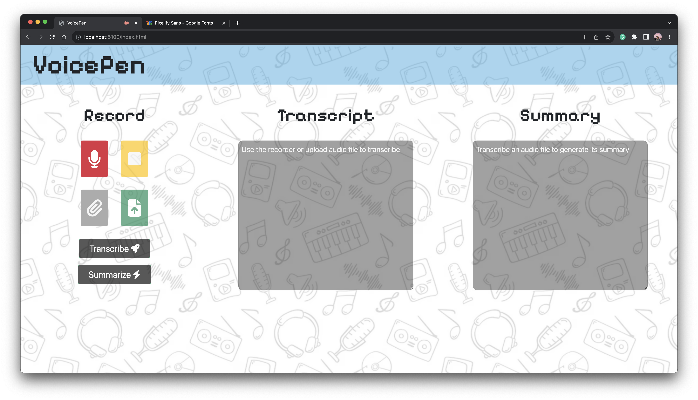

# VoicePen
*Submission for WEC GDSC Recruitment 2023*

**Description**

VoicePen is a web application for converting speech to text and summarizing text using APIs. The user has option either to record within the apllication itself or upload the audio clip from the system.

**Setup Locally**

Just clone the project using git clone. All the dependencies are already included. Make sure to include your API tokens for AssemlyAI API and HuggingFace API in .env file with names *ASSEMBLYAI_API_KEY* and *HUGGINGFACE_API_TOKEN*

**How it looks like**

**How it works**

The application records the audio using [MediaRecorder API](https://developer.mozilla.org/en-US/docs/Web/API/MediaRecorder) ( or uploads the audio ) and then sends the audio clip to AssemblyAI server where it transcribes the audio and returns the result. The result (which can be edited by the user) is sent to the HuggingFace server to get it's summary.

References :
<ul>
    <li>1. MDN Web Docs</li>
    <li>2. ralzohairi / js-audio-recording</li>
    <li>3. https://www.assemblyai.com/docs/api-reference/transcript</li>
    <li>4. https://www.assemblyai.com/blog/uploading-files-to-assemblyai-using-node-js-and-javascript/</li>
    <li>5. https://huggingface.co/docs/api-inference/detailed_parameters</li>
</ul>
